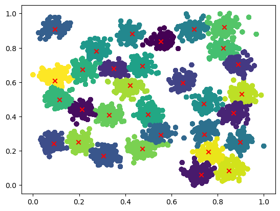

# Parallel-DensityPeaksClustering
USTC 2023 Spring Parallel Computing B Course Work: DensityPeaksClustering written in OpenMP &amp; Cuda


This work is inspired by serban's kmeans [serban/kmeans: A CUDA implementation of the k-means clustering algorithm (github.com)](https://github.com/serban/kmeans). Because my machine learning course project has done density peaks clustering algorithm, I would like to try it with OpenMP and Cuda.


`cat.txt`: origin dataset with 31 clusters (3100 data elements copied to 40300)

`catn.txt`: dataset preprocess by minmaxscaler (min-max normalization)


Here's usage:

```
"Usage: %s [switches] -i filename -n num_clusters\n"
        "       -i filename    : file containing data to be clustered\n"
        "       -n num_clusters: number of clusters (K must > 1)\n"
        "       -t d_c         : d_c value (default %.4f)\n"
        "       -h             : print this help information\n";
```


Here's some sample benchmark output for the dataset on an Intel(R) Xeon(R) Gold 6154 CPU @ 3.00GHz machine with an NVIDIA GeForce RTX 2080 Ti card. (Run the benchmark.sh)

```
========================== DensityPeaksClustering =============================
-------------------------------------------------------------------------------
seqTime = 60223.2270ms  ompTime = 34686.8233ms  speedup = 1.73x  (OpenMP Version)
seqTime = 60223.2270ms  cudaTime = 2817.4399ms  speedup = 21.37x  (Cuda Version)
seqTime = 60223.2270ms  cuda2Time = 548.6615ms  speedup = 109.76x  (Optimized Version)
seqTime = 60223.2270ms  cuda3Time = 632.3199ms  speedup = 95.24x  (Texture Version)
seqTime = 60223.2270ms  cuda4Time = 424.3925ms  speedup = 141.90x  (Shared Version)
-------------------------------------------------------------------------------
```


You can view the results of clustering by the following method:

```python
cat = pd.read_csv("./cat.txt", header=None, sep=" ")
cat_1 = np.array((cat - cat.min()) / (cat.max() - cat.min()))
centers = pd.read_csv("./catn.txt.centers", header=None, sep=" ")
labels = pd.read_csv("./catn.txt.category", header=None, sep=" ")

plt.scatter(cat_1[:, 0], cat_1[:, 1], c=labels[1])
plt.scatter(centers[1], centers[2], marker="x" , c="red")
```

results of clustering:


