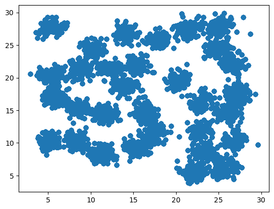
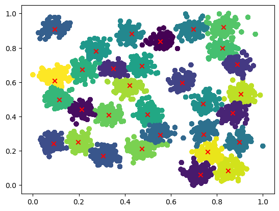

# 并行计算B 实验报告

PB20111689 蓝俊玮

[TOC]

## 1. 实验环境以及配置

本次实验在我的服务器上进行：

- 操作系统：Ubuntu 18.04.6 LTS
- 处理器：Intel(R) Xeon(R) Gold 6154 CPU @ 3.00GHz

- GPU：NVIDIA GeForce RTX 2080 Ti
- OpenMP：4.5
- Cuda：11.6

具体信息如下：


```
Device Name: NVIDIA GeForce RTX 2080 Ti
totalGlobalMem: 11020 MBytes---11554848768 Bytes
sharedMemPerBlock: 49152
regsPerBolck: 65536
warpSize: 32
memPitch: 2147483647
maxTreadsPerBlock: 1024
maxThreadsDim[0-2]: 1024 1024 64
maxGridSize[0-2]: 2147483647 65535 65535
totalConstMem: 65536
major.minor: 7.5
clockRate: 1545000
textureAlignment: 512
deviceOverlap: 1
multiProcessorCount: 68
```

## 2. 实验选题及意义

密度峰值聚类（Density Peaks Clustering）算法是一种非参数聚类算法，旨在识别具有不同密度的簇。它基于寻找数据集中的密度峰值，然后将这些峰值作为簇的中心，并通过距离测量方法来确定簇的边界。密度峰值聚类算法的核心思想是，将每个点视为一个高斯核，点的密度由其与其他点的距离函数给出。密度峰值是在一个给定半径范围内具有最大局部密度的点。通过比较密度峰值之间的距离，算法可以确定每个峰值所属的簇，并将具有相似密度峰值的点划分到同一簇中。

密度峰值聚类算法是一种非常有效的聚类算法，可用于处理不同密度的数据集，被广泛应用于图像分割、生物信息学、社交网络分析等领域。该算法集成了 k-means 和 DBSCAN 两种算法的思想，是一种不需要迭代，可以一次性找到聚类中心的聚类方法，其聚类效果优于许多传统的基于距离的聚类算法。

然而，该算法在处理大规模数据时存在计算复杂度高、速度慢的问题，因此需要进行并行加速优化。本次实验选题旨在通过并行计算技术，对密度峰值聚类算法进行加速优化。具体地，使用 OpenMP 和CUDA 并行框架，对算法的关键部分进行并行化改进，以提高算法的计算效率和处理大规模数据的能力。OpenMP 是一种基于共享内存的并行计算框架，可在单台计算机上利用多个 CPU 核心并行运行。CUDA 是一种基于 GPU 的并行计算框架，可将计算任务分配给 GPU 上的多个计算单元，从而加速计算过程。通过对密度峰值聚类算法进行并行化改进，可以实现更快速和高效的聚类分析，从而提高算法在实际应用中的可用性和实用性。

## 3. 算法原理

[密度峰值聚类（Density Peaks Clustering）算法](https://sites.psu.edu/mcnl/files/2017/03/9-2dhti48.pdf) 的关键是根据簇中心的特征绘制决策图，以快速识别准确的簇中心。簇中心具有两大特征：1. 簇中心被密度不超过它的邻居点包围，因此簇中心的局部密度相对较大；2. 簇中心的位置相对远离具有较高局部密度的任何其他对象，即两个簇中心之间的距离相对较远。

算法首先需要构造其距离矩阵。在本次实验中，距离矩阵的度量方式使用的是欧几里得距离：
$$
d_{ij}=||x_i-x_j||_2
$$
接着需要通过距离矩阵来计算局部密度 $\rho$ 和相对距离 $\delta$。局部密度 $\rho$ 定义为：
$$
\left\{\begin{matrix} 
\ p_i=\sum\limits_j \chi(d_{ij}-d_c)\\
\chi(x)=\left\{\begin{matrix}1,\ x<0\\0,\ x\ge0\end{matrix}\right.
\end{matrix}\right.
$$
其中, 参数 $d_c$ 称为截断距离，是唯一的输入参数。针对不同的数据集，需要根据经验设置不同的 $d_c$，通常选择数据集总体相似性 $2\%$ 位置处的值。另外, 当数据集规模较小时, $\rho_i$ 可以通过引入高斯核函数来计算：
$$
\rho_i=\sum\limits_j\exp(-\frac{d_{ij}^2}{d_c^2})
$$
不难看出，$\rho_i$ 表示距离 $d_{ij}$ 不超过 $d_c$ 的所有数据对象的集合。与此同时，相对距离 $\delta_i$ 表示局部密度大于 $x_i$ 且距离其最近的点的距离：
$$
\delta_i=\left\{\begin{matrix}\min\limits_{j:\rho_j>\rho_i}(d_{ij})\\
\max\limits_{j}(d_{ij})
\end{matrix}\right.
$$
由于密度最高的样本不存在比其密度更高的点，DPC 算法认为该点必为密度峰值（类簇中心），人为设定其相对距离为最大值。剩余的密度峰值需要同时满足两个条件：局部密度 $\rho_i$ 较高以及相对距离 $\delta_i$ 较大。为此，DPC 算法的原论文通过决策值 $\gamma$ 寻找这类密度峰值，$\gamma$ 定义为：
$$
\gamma_i=\rho_i\times\delta_i
$$
找到密度峰值（类簇中心）后，DPC 算法将剩余数据点分配给密度比它高的最近数据点所在类簇，形成多个从密度峰值出发的树状结构，每一个树状结构代表一个类簇。

## 4. 算法步骤

从上述的算法原理可以得到算法的执行步骤为：

1. 确定截断距离 $d_c$
2. 利用样本数据集计算矩阵距离 $d_{ij}$
3. 分别对每个样本点计算出其 $\rho_i$ 和 $\delta_i$
4. 计算出每个样本点的 $\gamma_i$
5. ~~绘制决策图~~（根据指定的类数），选取聚类中心点
6. 对非聚类中心数据点进行归类

## 5. 算法实现

算法实现主要以串行程序为主要示例进行解释说明。

### 5.1 串行程序

首先定义我们的数据结构如下：

```cpp
class DensityPeaksClustering {
    public:
        int numObjs, numCoords, numClusters;
        float d_c;
        int *rho, *nearest, *gamma_index, *category, *center;
        int *center_index, *rho_index_sorted;
        float *delta, *gamma;
        float **objects, **distance, **clusters;

        DensityPeaksClustering(int numObjs, int numCoords, int numClusters, float **objects, float d_c);
        ~DensityPeaksClustering();
        float euclid_dist(int numCoords, float *coord1, float *coord2);
        int *argsort(int numObjs, float *arrs);
        int *argsort(int numObjs, int *arrs);
        void get_distance();
        void get_rho();
        void get_delta();
        void get_gamma();
        void fit();
};
```

这段代码实现了密度峰值聚类算法，是一个聚类分析的工具类。下面对其主要功能进行分析：

- 初始化函数 `DensityPeaksClustering()`：

  该函数是类的构造函数，用于初始化聚类算法的参数和数据结构。其中，`numObjs` 表示数据集中数据点的数量，`numCoords` 表示每个数据点的维度数，`numClusters` 表示聚类的数量，`objects` 是一个二维数组，存储了数据集中所有的数据点，`d_c` 是一个参数，用于指定密度半径。`rho`、`nearest`、`gamma_index`、`category`、`center`、`center_index`、`rho_index_sorted`、`delta` 和 `gamma` 都是指针类型的数组，用于存储聚类过程中的中间结果。

- 析构函数 `~DensityPeaksClustering()`：

  该函数是类的析构函数，用于释放聚类算法中使用的动态内存空间。

- 欧几里得距离计算函数 `euclid_dist()`：

  该函数用于计算两个数据点之间的欧几里得距离。其中，`numCoords` 表示数据点的维度数，`coord1` 和 `coord2` 分别表示两个数据点在每个维度上的坐标。

- `argsort()` 函数：

  `argsort()` 函数是一个模板函数，用于对一个数组进行排序，并返回排序后的索引数组。该函数可用于对密度、距离等数组进行排序。

- `get_distance()` 函数

  该函数用于计算数据集中每个数据点与其他数据点之间的距离，并将结果存储在 `distance` 数组中。该函数通过调用 `euclid_dist()` 函数计算欧几里得距离。

- `get_rho()` 函数

  该函数用于计算每个数据点的密度 `rho`，并将结果存储在 `rho` 数组中。该函数通过计算在密度半径 `d_c` 内与当前数据点的距离小于 `d_c` 的数据点数量来计算密度 `rho`。

  ```cpp
  void DensityPeaksClustering::get_rho() {
      for (int i = 0; i < numObjs; i++) {
          rho[i] = 0;
          for (int j = 0; j < numObjs; j++) {
              if (distance[i][j] < d_c) {
                  rho[i]++;
              } 
          }
          rho[i] -= 1;    // exclude itself
      }
  }
  ```

- `get_delta()` 函数

  该函数用于计算每个数据点的局部密度距离 `delta`，并将结果存储在 `delta` 数组中。该函数通过计算每个数据点与密度大于该数据点的密度的数据点之间的最小距离来计算局部密度距离 `delta`。

  ```cpp
  void DensityPeaksClustering::get_delta() {
      rho_index_sorted = argsort(numObjs, rho);	// 对密度进行排序
      for (int seq = 0; seq < numObjs; seq++) {
          int i = rho_index_sorted[seq];
          if (seq == 0)
              continue;	// 除去密度最高的点
          int *j = (int*)malloc(sizeof(int) * seq);
          memcpy(j, rho_index_sorted, sizeof(int) * seq);// 选取比当前密度更高的点
          float minn = MAXFLOAT;
          int nearest_index = 0;	// 在密度更高的点中选取最近的距离
          for (int k = 0; k < seq; k++) {
              if (distance[i][j[k]] < minn) {
                  minn = distance[i][j[k]];
                  nearest_index = k;	// 记录最近的点
              }
          }
  
          delta[i] = minn;
          nearest[i] = j[nearest_index];
      }
      float maxx = 0;
      for (int j = 0; j < numObjs; j++) {
          maxx = std::max(maxx, distance[rho_index_sorted[0]][j]);
      }
      delta[rho_index_sorted[0]] = maxx;	// 最后记录密度最高的点的局部密度距离
  }
  ```

- `get_gamma()` 函数

  该函数用于计算每个数据点的 `gamma` 值，并将结果存储在 `gamma` 数组中。该函数通过计算每个数据点的 `rho` 值与 `delta` 值的乘积来计算 `gamma` 值。

- `fit()` 函数

  该函数是聚类算法的主要函数，用于执行聚类过程。该函数通过比较每个数据点的 `gamma` 值来确定聚类中心，并将每个数据点分配给最近的聚类中心。聚类过程中，使用了 `category`、`center` 数组来存储聚类结果。

  ```cpp
  void DensityPeaksClustering::fit() {
      get_distance();
      get_rho();   
      get_delta();
      get_gamma();
      int current_category = 1;
      for (int seq = 0; seq < numObjs; seq++) {
          int i = gamma_index[seq];
          if (seq >= numClusters)		// 与论文中的实现不一样，为了方便本次实验，我们直接使用聚类类数来选取
              break;
          category[i] = current_category;		// 聚类中心点的类别
          center[i] = current_category;		// 聚类中心点的类别
          center_index[seq] = i;
          for (int j = 0; j < numCoords; j++) {
              clusters[seq][j] = objects[i][j];	// 记录聚类中心点的坐标
          }
          current_category++;
      }
      // 从密度高的点开始归类非聚类中心的点，因为我们的类别指派是需要从高密度到低密度进行的
      for (int seq = 0; seq < numObjs; seq++) {
          int i = rho_index_sorted[seq];
          if (category[i] == 0)	// 如果它不是聚类中心
              category[i] = category[nearest[i]];		// 则选择最近的密度更高的点的类别作为它的类别
      }
  }
  ```

### 5.2 OpenMP 实现

当需要处理大量数据或复杂计算时，串行的程序可能会变得非常慢。为了提高程序的运行效率，可以使用并行化技术来将任务分成多个子任务，然后在多个处理器或核心上同时执行，从而加快程序的运行速度。OpenMP 是一种基于共享内存的并行化技术，它可以通过简单的指令和注释来并行化现有的 C/C++ 程序。在上述代码中，使用 OpenMP 并行化技术可以将一些计算密集型的任务并行化执行，从而加快程序的运行速度。

在上述代码中，主要的性能瓶颈在于 `get_distance()` 函数。该函数计算两两数据之间的距离，其时间复杂度是 $O(n^2)$ 的。因为该距离矩阵具有对称性，所以我们在实现的时候只需要计算上三角矩阵的位置，这样可以将时间复杂度降至 $O(n^2/2)$。但是这样的计算任务量还是很大，所以我们可以通过 `parallel for` 结构并行执行。

```cpp
void DensityPeaksClustering::get_distance() {
    omp_set_num_threads(NUM_THREADS);
    #pragma omp parallel num_threads(NUM_THREADS) shared(distance, objects, numObjs)
    {
        int tid = omp_get_thread_num();
        #pragma omp parallel for
        for (int i = tid; i < numObjs; i += NUM_THREADS) 
        {
            for (int j = i; j < numObjs; j++) 
            {
                distance[i][j] = euclid_dist(numCoords, objects[i], objects[j]);
                distance[j][i] = distance[i][j];
            }
        }
    }
}
```

但是由于 OpenMP 有限的并行化功能，它的目的是为了提高程序的运行效率和可扩展性，而不是为了实现所有的并行化需求。加上程序中涉及的只是大量独立的浮点数计算和数值比较，所以我们只能简单地使用 OpenMP 对其做一定程度的加速。对于算法中 $\rho$ 和 $\delta$ 部分的计算也是如此。

### 5.3 CUDA 实现

在使用 CUDA 实现上述算法的时候，由于 CUDA 涉及设备端和主机端数据的移动，因此我们不再使用 `DensityPeaksClustering` 类对这些变量进行封装。而是只对需要在 GPU 中计算的数据分配 GPU 空间，而最后算法计算出来的数据就分配在主机端，这样就可以减少数据移动之间的开销。

还是以 `get_distance()` 函数为例：

```cpp
__global__ void get_distance(int numCoords, int numObjs, float *objects1, float *distance1) {
    int tid_x = threadIdx.x;
    int tid_y = threadIdx.y;
    for (int i = tid_y; i < numObjs; i += blockDim.y) {
        for (int j = tid_x; j < numObjs; j += blockDim.x) {
            if (j >= i) {
                float num = euclid_dist(numCoords, objects1, i, j);
                distance1[i * numObjs + j] = num;
                distance1[j * numObjs + i] = num;
            }
        }
    }
}
```

该函数使用 CUDA 的并行计算功能来加速计算过程。具体来说，该函数使用两个线程块维度来并行化计算过程：`threadIdx.x `和`threadIdx.y`。根据这两个维度的值，每个线程可以计算数据集中的一部分样本之间的欧几里得距离。该函数使用两个嵌套循环来计算数据集中任意两个样本之间的欧几里得距离。外层循环遍历所有的样本，内层循环遍历当前样本之后的所有样本。由于欧几里得距离是对称的，因此只需计算其中一半的距离，并将结果复制到另一半中。虽然该函数可以加速计算过程，但由于内存访问和计算结果存储等原因，可能会成为性能瓶颈。

而对于其它函数，例如 `get_gamma()` 函数，由于我们使用的线程块维度是 2 维，但是在这些函数实际上只需要 1 维的线程块（主要因为 `get_distance()` 才是算法的瓶颈计算，所以我们需要开 2 维的线程块来并行），因此在这里我们将线程号重新组织排布成：

```cpp
__global__ void get_gamma(int numObjs, int *rho, float *delta, float *gamma) {
    int tid_x = threadIdx.x;
    int tid_y = threadIdx.y;
    for (int i = tid_y * blockDim.x + tid_x; i < numObjs; i += blockDim.x * blockDim.y) {
        gamma[i] = rho[i] * delta[i];
    }
}
```

### 5.4 CUDA 优化

在上面实现时采用了单 block 多 threads 的方法进行并行。为了最大程度的并行加速我们的代码，我们将其设置为多 blocks 多 threads 的方式进行并行加速。同时可以看出，在函数 `get_delta()` 中有非必要的内存分配操作，可以将这段代码删除：

```cpp
int *j = (int*)malloc(sizeof(int) * seq);
memcpy(j, rho_index_sorted, sizeof(int) * seq);	// 选取比当前密度更高的点
```

同时在 `get_delta` 中有计算最大值的部分，我们也可以对这一步进行优化。优化方式是采用规约的 `max` 算法。通过规约的方式，可以将 $O(n)$ 的线性查找降至 $O(\log n)$，具体实现是使用 `thrust::max_element()` 来完成：

``` cpp
int idx = rho_index_sorted[0];
float *result = thrust::max_element(thrust::device, distance1 + idx, distance1 + idx + numObjs);
delta[idx] = *result;
```

而在该函数中，还有一部分也是需要查找最小值。

```cpp
for (int k = 0; k < seq; k++) {
    // 地址非连续，无法规约max
    float dist = distance1[i * numObjs + rho_index_sorted[k]];
    if (dist < minn) {
        minn = dist;
        nearest_index = k;
    }
}
```

但是这个部分是不能采用规约的方式查找最小值，因为我们需要从密度高到低的顺序进行处理，而这个密度高到低顺序的数据的内存分布不是连续的，因此无法采用规约的方式进行查找。

### 5.5 CUDA 纹理存储

纹理存储是一种 CUDA 的高速缓存技术，用于加速从全局内存中读取数据的过程。使用纹理存储可以提高性能，减少内存访问的延迟，提高内存访问的带宽，从而可以加速许多计算密集型应用程序。纹理存储使用了一些优化技术，如空间局部性和纹理缓存，以更好地缓存数据。这些技术可以使访问纹理数据变得更加高效，从而提高应用程序的性能。在之前的分析，我们知道在 `get_distance()` 函数中存在大量重复访问全局内存的行为，尽管我们采取了对称化的处理方式，还是避免不了这些重复访存的行为，其具体表现如下：

当处理第 1 个数据的时候，我们需要访问剩余的所有 `numObjs` 个数据。而其实在这里，我们就已经访问过了所有的数据。那么在处理第 2 个数据的时候，我们需要访问剩余的共 `numObjs - 1` 个数据。那么通过纹理的这种缓存技术，我们就有可能通过访问更快的缓存，从而取代访问更慢的全局内存以达到程序加速的目的。

由于老师 PPT 中的纹理使用方式已经被弃用，所以我使用了纹理对象来实现。

首先是定义通道，并且创建 CUDA 数组。CUDA 数组是专为纹理操作而设计的，位于显存池，不能直接使用，需要通过纹理才能访问：

```cpp
cudaArray *srcArray;
cudaChannelFormatDesc channelDesc = cudaCreateChannelDesc(32, 0, 0, 0, cudaChannelFormatKindFloat);
cudaMallocArray(&srcArray, &channelDesc, numCoords, numObjs);
cudaMemcpy2DToArray(srcArray, 0, 0, objects1, numCoords * sizeof(float), numCoords * sizeof(float), numObjs, cudaMemcpyHostToDevice);
```

我们通过 `cudaCreateChannelDesc(32, 0, 0, 0, cudaChannelFormatKindFloat);` 定义出数据为 32 位大小的浮点数类型，并且将我们的二维数据坐标点复制进 CUDA 数组内。

然后就是创建纹理对象：

```cpp
struct cudaResourceDesc resDesc;
memset(&resDesc, 0, sizeof(resDesc));
resDesc.resType = cudaResourceTypeArray;
resDesc.res.array.array = srcArray;

struct cudaTextureDesc texDesc;
memset(&texDesc, 0, sizeof(texDesc));
texDesc.addressMode[0] = cudaAddressModeBorder;
texDesc.addressMode[1] = cudaAddressModeBorder;
texDesc.filterMode = cudaFilterModeLinear;
texDesc.readMode = cudaReadModeElementType;
texDesc.normalizedCoords = 1;

cudaTextureObject_t texObj = 0;
cudaCreateTextureObject(&texObj, &resDesc, &texDesc, NULL);
```

这里也没有什么需要特别说明的。这里我尝试过不同的滤波模式和寻址模式，结果都是一样的。得到纹理对象之后，我们就可以通过纹理对象来直接获取数据：

```cpp
__device__ float euclid_dist(int numCoords, int numObjs, cudaTextureObject_t texObj, int i, int j) {
    float ans = 0.0;
    for (int k = 0; k < numCoords; k++) {
        float x = tex2D<float>(texObj, (k + 0.5) / numCoords, (i + 0.5) / numObjs);
        float y = tex2D<float>(texObj, (k + 0.5) / numCoords, (j + 0.5) / numObjs);
        ans += (x - y) * (x - y);
    }
    return sqrt(ans);
}

__global__ void get_distance(int numCoords, int numObjs, cudaTextureObject_t texObj, float *distance1) {
    int tid_x = threadIdx.x;
    int tid_y = threadIdx.y;
    int bid_x = blockIdx.x;
    int bid_y = blockIdx.y;
    int x = bid_x * blockDim.x + tid_x;
    int y = bid_y * blockDim.y + tid_y;
    for (int i = y; i < numObjs; i += gridDim.y * blockDim.y) {
        for (int j = x; j < numObjs; j += gridDim.x * blockDim.x) {
            if (j >= i) {
                float num = euclid_dist(numCoords, numObjs, texObj, i, j);
                distance1[i * numObjs + j] = num;
                distance1[j * numObjs + i] = num;
            }
        }
    }
}
```

### 5.6 CUDA 共享内存

共享内存是专门为GPU设计的一种内存类型，因此它可以通过硬件优化来提高访问速度。例如，共享内存可以使用硬件缓存和存储器结构进行更有效的访问。共享内存是在块内部共享的，可以被块内的所有线程并发访问，可以快速进行同步和通信操作。它可以避免重复从全局内存中读取数据。这种数据复用可以减少数据访问的延迟和带宽，从而提高应用程序的性能。

因此，使用共享内存对程序进行优化十分重要。因为在上述的分析中我们知道，在计算 `get_distance()` 中存在大量重复访存，因此十分适合使用共享内存对其优化。

```cpp
__global__ void get_distance(int numCoords, int numObjs, float *objects1, float *distance1) {
    int tid_x = threadIdx.x;
    int tid_y = threadIdx.y;
    int bid_x = blockIdx.x;
    int bid_y = blockIdx.y;
    int x = bid_x * blockDim.x + tid_x;
    int y = bid_y * blockDim.y + tid_y;

    __shared__ float tempi[32][2];
    for (int i = y; i < numObjs; i += gridDim.y * blockDim.y) {
        tempi[tid_y][0] = objects1[i * numCoords];
        tempi[tid_y][1] = objects1[i * numCoords + 1];
        float i1 = tempi[tid_y][0];
        float i2 = tempi[tid_y][1];

        __shared__ float tempj[32][2];
        for (int j = x; j < numObjs; j += gridDim.x * blockDim.x) {
            tempj[tid_x][0] = objects1[j * numCoords];
            tempj[tid_x][1] = objects1[j * numCoords + 1];
            
            __syncthreads();

            if (j >= i) {
                float num = 0.0;
                float j1 = tempj[tid_x][0];
                float j2 = tempj[tid_x][1];
                num += (i1 - j1) * (i1 - j1);
                num += (i2 - j2) * (i2 - j2);
                num = sqrt(num);
                distance1[i * numObjs + j] = num;
                distance1[j * numObjs + i] = num;
            }
        }
    }
}
```

因为不同块中的线程无法存取同一共享内存，因此在块间是无法直接通信或进行同步的。而在我们的双重循环计算之中，实际上是在不同块之间进行的。当其处理第 i 行的时候，其处理的 j 列绝大多数都是不处于同一个块之间的，因此我们需要分别为行和列都定义一个共享内存，用来存储数据。在上面提到过，当处理第 1 个数据的时候，我们需要访问剩余的所有 `numObjs` 个数据。而在处理第 2 个数据的时候，我们还需要访问剩余的共 `numObjs - 1` 个数据，但是实际上这有部分数据是可以通过共享内存进行存储的，从而减少重复访存的次数。

那么就说明，其实在一个线程块内，我们是在行和列上分别进行处理的，我们就可以分别对行和列进行存储。即当行索引是 `i` 的时候，通过共享内存我们就可以存储下 `j` 到 `j + blockDim.x` 的数据，那么当行索引是 `i + 1` 的时候，此时在之前我们就已经将 `j + 1` 到 `j + blockDimx.x ` 的数据存储到了共享内存中，那么此时就不再需要访问全局内存了。

所以通过上面的方法，我们可以为行和列分别进行存储，当然重点就是需要分别存储，且我们需要对列的数据不断进行存储。这是因为在内循环中，我们将会切换块，所以我们需要在不同块内都声明一个共享内存。

同时，在这里我们也通过提前保存行的值，而不再使用 `euclid_dist()` 函数计算，从而减少行的重复访问操作（因为调用这个函数时每次都会对行的数据进行访存，但实际上这是冗余的）。

## 6. 遇到的问题

首先是在原始设计程序的时候，我采用的是类对这些数据进行封装，以便于共享访问。但是在使用 CUDA 编程时，我发现在这个类内的指针无法正常分配，在查阅了不少资料之后，发现这个问题比较难解决（因为 CUDA 有 `__device__` 且数据需要在 GPU 中 `cudaMalloc`，所以在主机端很难进行操作）。因此决定不再使用封装的类，而是直接使用这些数据进行处理。

在刚开始使用共享内存的时候，设计了很多种共享内存的方式都以失败告终。经过不断的思考和尝试，最终发现在这双重循环之间，首先行和列的处理的数据是不一样的，其次它们是在不同块之间进行的，因此我们需要在每次循环之前都重新写入共享内存。这是一种动态并行的方式，与矩阵相乘的处理很相似，需要不断的写入共享内存，不能在循环之前就写入共享内存而结束。

其次在双重循环之间写完共享内存之后进行同步时，不能在外循环和内循环内都使用 `__syncthreads()`，即：

```cpp
for (int i = y; i < numObjs; i += gridDim.y * blockDim.y) {
    tempi[tid_y][0] = objects1[i * numCoords];
    tempi[tid_y][1] = objects1[i * numCoords + 1];
    float i1 = tempi[tid_y][0];
    float i2 = tempi[tid_y][1];
    
    // __syncthreads();		// 这里不能使用

    __shared__ float tempj[32][2];
    for (int j = x; j < numObjs; j += gridDim.x * blockDim.x) {
        tempj[tid_x][0] = objects1[j * numCoords];
        tempj[tid_x][1] = objects1[j * numCoords + 1];

        __syncthreads();

        // ......
    }
}
```

这是因为在内外循环之间，是在不同块间进行计算的。CUDA 设备上的线程是按块组织的。每个块中的线程可以共享同一块共享内存，但是不同块的共享内存是独立的。因此，在两个不同的块中，`__syncthreads()` 函数无法同步线程，因为这些线程在不同的共享内存中运行。在上述代码中，外层循环和内层循环中的线程都属于不同的块，因此在外层循环中使用 `__syncthreads()` 函数是无效的，甚至可能会导致死锁或未定义的行为。而实际上它确实会发生死锁的现象。内外循环都在等待对方的线程同步，但实际上它们根本无法同步。因此，只能在内层循环中使用 `__syncthreads()` 函数，而不是在两个循环之间都使用它。

本程序中实际上还有一部分内容可以进行优化，但是我尝试多次都未能完成。例如在 `get_rho()` 函数中有

```cpp
for (int i = x; i < numObjs; i += blockDim.x * blockDim.y * gridDim.x * gridDim.y) {
    rho[i] = -1;
    for (int j = 0; j < numObjs; j++) {
        if (distance1[i * numObjs + j] < d_c) {
            rho[i]++;
        }
    }
}
```

可以看出，如果对内循环进行并行的话，其性能也会有一定程度的提高。但是内循环是有一段同步写的问题，如果不对它进行保护的话，不同线程对其同时写入的时候可能会发生异常的行为。对此我采用过 `atomicAdd()` 函数进行原子操作。但是使用后发现程序还是错误，因此我放弃了这个方法，同时也没有找到解决方案。

同时，在本次程序中还有 `argsort` 进行排序，这个很显然也可以进行并行优化，但是由于 `argsort` 本身的复杂性，因此我未能实现并行方法。同时我也尝试过使用 `thrust::sort_by_key`，发现其性能没有 `std::sort` 快，因此最后还是使用 `std::sort` 完成 `argsort`，毕竟 `std::sort` 中本身就有很多优化处理。

## 7. 性能测试

我通过编写一个脚本来一次性测试所有程序的性能，并且计算出加速比，可以得到运行结果如下（这是少有的服务器空闲的时候）：

```
========================== DensityPeaksClustering =============================
-------------------------------------------------------------------------------
seqTime = 60223.2270ms  ompTime = 34686.8233ms  speedup = 1.73x  (OpenMP Version)
seqTime = 60223.2270ms  cudaTime = 2817.4399ms  speedup = 21.37x  (Cuda Version)
seqTime = 60223.2270ms  cuda2Time = 548.6615ms  speedup = 109.76x  (Optimized Version)
seqTime = 60223.2270ms  cuda3Time = 632.3199ms  speedup = 95.24x  (Texture Version)
seqTime = 60223.2270ms  cuda4Time = 424.3925ms  speedup = 141.90x  (Shared Version)
-------------------------------------------------------------------------------
```

可以看到，由于 OpenMP 有限的并行功能，所以其加速比并不是很高。而只使用了一个块的 CUDA 程序的加速比也是比较不错的。对于整体优化后的 CUDA 程序，其加速比也是非常的高，充分体现出了 GPU 的浮点计算能力和并行处理的能力。而纹理存储的程序加速比有所下降，因为纹理存储的访问方式更加复杂，并且在访问纹理内存时需要进行一些额外的计算，这些额外的计算包括纹理坐标的计算和插值等操作，以保证采样的精度和正确性，这些额外的计算会导致访问纹理内存的延迟和额外的开销，从而导致程序的执行效率降低。而共享内存的使用可以进一步提高程序的性能。但是由于我们已经处理过其计算的对称性了，因此共享内存的优化也是只能在一定程度上提高程序的性能。

同时我也使用了 Python 代码来运行这个数据集，发现运行了 20 分钟都没有得到结果，由此可以看到 CUDA 并行处理的强大。

## 8. 结果展示

<center class="half">
    
	
</center>

